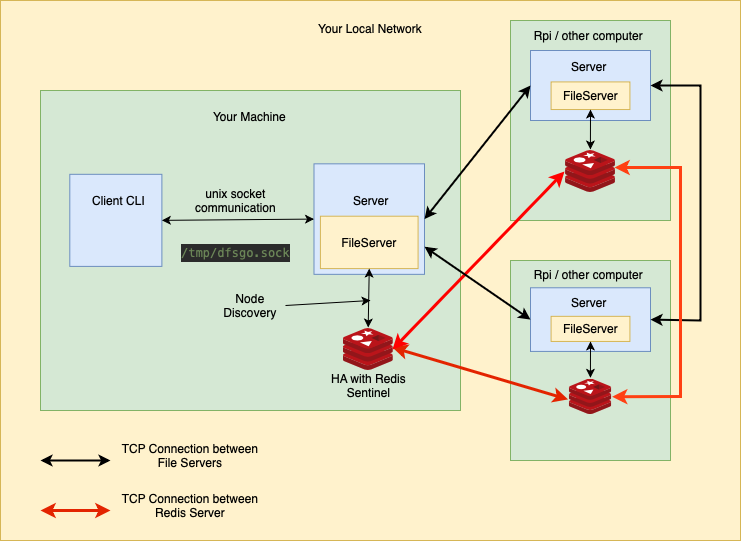

# Distributed File Storage DSFGO

## Overview

Welcome to the Distributed File Storage Project DSFGO! This project is designed to provide a scalable and highly available file storage solution using a distributed architecture. The architecture of the project is based on the following image:



## Objective

The main objective of this project is to explore and interact with the `net` library in Go (Golang) and to implement Redis Sentinel functionality for high availability. This project is ideal for developers looking to deepen their understanding of network programming in Go and to gain practical experience with Redis Sentinel.

### Node Discovery Service

With the integration of Redis and Redis Sentinel, a node discovery module was developed to facilitate the seamless interconnection of nodes within the system. This module automatically detects and removes dead or non-existent nodes, ensuring the system maintains an accurate and functional network topology.

Key technical details include:

- **Node Registration**: When a new node is started, it registers itself with the Redis server. This registration includes the node's address and status, which is continuously monitored by Redis Sentinel.

- **Automatic Node Removal**: The node discovery module then automatically removes the node from the list of active nodes, preventing the system from attempting to communicate with a dead or non-existent node. thisis done when a new node is added to the network.

- **High Availability**: By leveraging Redis Sentinel's high availability features, the node discovery module ensures that node information is consistently available, even in the event of Redis server failures. Redis Sentinel promotes a replica to master if the current master fails, maintaining the integrity of the node discovery system.

## Features

- **Distributed Architecture**: The system is designed to distribute files across multiple nodes to ensure scalability and reliability.
- **File Encription**: The File Server hash the capability to encrypt the file distributed to the other nodes
- **High Availability**: Utilizing Redis Sentinel to manage and monitor Redis instances, ensuring the discovery system remains available even if some components fail.
- **Network Programming in Go**: Leveraging the `net` library to handle network communication between nodes.

## Getting Started

### Prerequisites

Before you begin, ensure you have the following installed:

- Go (Golang) 1.18 or higher
- Redis 6.0 or higher
- Docker (optional, for containerized deployment)

### Installation

1. Clone the repository:

   ```sh
   git clone https://github.com/GusGA/dfsgo.git
   cd dfsgo
   ```

2. Install dependencies:

   ```sh
   go mod tidy
   ```

3. Start Redis with Sentinel (Docker example):

   ```sh
   docker-compose up -d
   ```

### Configuration

1. Update the configuration file `config.json` with your specific settings:

   ```json
   {
     "redis": {
       "masterName": "mymaster",
       "sentinelAddrs": ["localhost:26379"]
     }
   }
   ```

2. Start the file storage nodes:

   ```sh
   go run cmd/node/main.go -config=config.json
   ```

### Usage

TODO

#### Example: Upload a File

TODO

```sh

```
